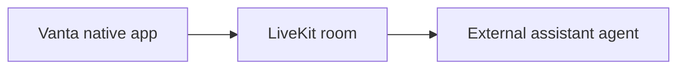

# Vanta

A React Native client for connecting to a LiveKit room and interacting with a live assistant.
The connection screen accepts a server URL and room token; the room UI handles the session.

## System boundary



The repository contains the mobile client. A token issuer, LiveKit deployment and assistant
agent must be supplied separately. The UI's Gemini assistant label is not evidence that a
Gemini backend is implemented in this checkout.

## Development setup

Use Node 20+ and the native toolchain for your target platform.

```bash
git clone https://github.com/DanushArun/Vanta.git
cd Vanta
npm ci
npm start
```

In another terminal:

```bash
npm run android
```

For iOS, install Ruby/CocoaPods dependencies and then run the native app:

```bash
bundle install
cd ios
bundle exec pod install
cd ..
npm run ios
```

Use your own LiveKit URL and a valid session token in the connection screen.
Grant the requested media permissions for the session.

## Source and verification

[App.tsx](App.tsx) contains connection and room UI. The manifest declares React Native 0.83.1,
React 19.2.0 and LiveKit native/WebRTC packages.

```bash
npm run lint
npm test -- --runInBand
```

These are the declared verification commands; they were not rerun for this documentation update.
Source and manifest inspection does not establish media quality, reconnection reliability,
provider availability or a successful assistant conversation. No live room was joined.
