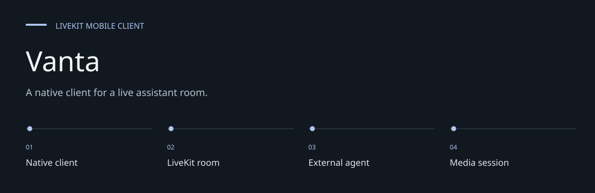
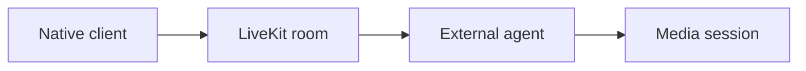
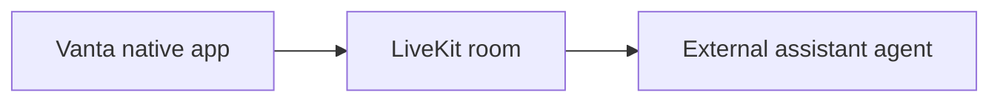

# Vanta

**A native client for a live assistant room.**

A React Native client for connecting to a LiveKit room and interacting with a live assistant.
The connection screen accepts a server URL and room token; the room UI handles the session.


[Architecture](docs/ARCHITECTURE.md) · [Evaluation guide](docs/EVALUATION.md)

**Contents:** [The challenge](#the-challenge) · [Walkthrough](#walk-through-the-project) ·
[Implementation](#implementation-state) · [Design choices](#engineering-choices) ·
[Next evidence](#next-evidence-to-collect)

---

## The challenge

A real-time assistant needs a usable native connection and media experience in addition to a model
backend. Vanta provides the client side: room credentials, connection controls and a room
interface, while the service and agent live outside this repository.

## System at a glance



## Walk through the project

### 1. Supply a room

Enter an authorized LiveKit server URL and valid session token. The repository does not issue
those tokens.

### 2. Connect the client

Join the room through the native LiveKit integration and handle requested media permissions.

### 3. Interact with the room

Inspect media/session UI and the external assistant response. The Gemini label does not establish
a Gemini agent implementation in this checkout.

### 4. Disconnect and repeat

Review cleanup, reconnection and invalid-token behavior. A successful connection is a narrower
result than a reliable multi-turn assistant session.

## System boundary



The repository contains the mobile client. A token issuer, LiveKit deployment and assistant
agent must be supplied separately. The UI's Gemini assistant label is not evidence that a
Gemini backend is implemented in this checkout.

## Development setup

Use Node 20+ and the native toolchain for your target platform.

```bash
git clone https://github.com/DanushArun/Vanta.git
cd Vanta
npm ci
npm start
```

In another terminal:

```bash
npm run android
```

For iOS, install Ruby/CocoaPods dependencies and then run the native app:

```bash
bundle install
cd ios
bundle exec pod install
cd ..
npm run ios
```

Use your own LiveKit URL and a valid session token in the connection screen.
Grant the requested media permissions for the session.

## Source and verification

[App.tsx](App.tsx) contains connection and room UI. The manifest declares React Native 0.83.1,
React 19.2.0 and LiveKit native/WebRTC packages.

```bash
npm run lint
npm test -- --runInBand
```

These are the declared verification commands; they were not rerun for this documentation update.
Source and manifest inspection does not establish media quality, reconnection reliability,
provider availability or a successful assistant conversation. No live room was joined.

## Engineering choices

**Client/service split.** Room configuration is supplied rather than silently treated as a bundled
backend.

**Native media integration.** Platform permissions and builds are required parts of evaluation.

**Session tokens.** A room token has a defined authorization scope; it is not a replacement for a
token service.

## Implementation state

| State | Current evidence |
| --- | --- |
| Present | Native connection and room UI |
| Present | LiveKit/WebRTC integration dependencies |
| External | Room server, token issuer and assistant agent |
| Not verified | Conversation quality or reconnection reliability |

The [architecture guide](docs/ARCHITECTURE.md) maps these statements to source entry points.
The [evaluation guide](docs/EVALUATION.md) separates inspection, executable checks and
domain validation, with the next evidence needed for each project.

## Next evidence to collect

- Supply a controlled test room and token issuer.
- Record connection, denial, disconnect and reconnection cases.
- Measure a complete assistant conversation on both target platforms.
