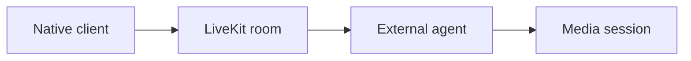

# Vanta — Architecture and implementation

This guide follows the tracked implementation. Proposed work is identified separately.

## The problem and the system boundary

A real-time assistant needs a usable native connection and media experience in addition to a model
backend. Vanta provides the client side: room credentials, connection controls and a room
interface, while the service and agent live outside this repository.

## Processing path

## End-to-end behavior

### 1. Supply a room

Enter an authorized LiveKit server URL and valid session token. The repository does not issue
those tokens.

### 2. Connect the client

Join the room through the native LiveKit integration and handle requested media permissions.

### 3. Interact with the room

Inspect media/session UI and the external assistant response. The Gemini label does not establish
a Gemini agent implementation in this checkout.

### 4. Disconnect and repeat

Review cleanup, reconnection and invalid-token behavior. A successful connection is a narrower
result than a reliable multi-turn assistant session.

## Design choices and consequences

### Client/service split

Room configuration is supplied rather than silently treated as a bundled backend.

### Native media integration

Platform permissions and builds are required parts of evaluation.

### Session tokens

A room token has a defined authorization scope; it is not a replacement for a token service.

## Source entry points

### [App.tsx](../App.tsx)

This file is part of the reviewed path described above. Follow its imports and calls
for the exact interface rather than inferring behavior from the filename.

### [package.json](../package.json)

This file is part of the reviewed path described above. Follow its imports and calls
for the exact interface rather than inferring behavior from the filename.

## Implementation state

| State | Evidence boundary |
| --- | --- |
| Present | Native connection and room UI |
| Present | LiveKit/WebRTC integration dependencies |
| External | Room server, token issuer and assistant agent |
| Not verified | Conversation quality or reconnection reliability |

“Present” means tracked source or assets exist. It does not mean a production or domain
validation has passed. See [Evaluation](EVALUATION.md) for reproducible checks and limits.
